<div align="center">
  <br>
  
  <br><br>

  [](https://www.npmjs.com/package/@kernlang/cli)
  [](https://github.com/KERNlang/kern/actions/workflows/ci.yml)
  [](https://github.com/KERNlang/kern/releases)
  [](LICENSE)

  <br>

  **Built for humans and AI.** 192-line spec. 12 compile targets. 98 review rules.<br>
  <sub>LLMs write .kern in up to 85% fewer tokens. 7 LLMs verified.</sub>

  <br>

  [**kernlang.dev**](https://kernlang.dev) &nbsp;&bull;&nbsp; [MCP](https://kernlang.dev/mcp) &nbsp;&bull;&nbsp; [Review](https://kernlang.dev/review) &nbsp;&bull;&nbsp; [Playground](https://kernlang.dev/playground) &nbsp;&bull;&nbsp; [Docs](https://kernlang.dev/docs) &nbsp;&bull;&nbsp; [For LLMs](https://kernlang.dev/llm)

  <br>
</div>

---

## Install

```bash
npm install -g @kernlang/cli
```

```bash
kern compile src/ --target=nextjs --watch --facades --index   # One command — compile, watch, facades, barrel
kern review src/ --recursive                                  # Static analysis (98 rules, taint tracking)
kern init --template=fullstack my-app                          # Scaffold fullstack app (Next.js + Express + MCP)
kern init --mcp                                               # Scaffold an MCP server with security guards
kern import src/ --outdir=kern/                               # TypeScript → .kern
kern schema --json                                            # Full schema for LLM consumption
```

---

## What is KERN?

**KERN is a structural language with five capabilities: Compile, Review, Evolve, Infer, and MCP Security.**

Write `.kern` once, compile to 12 targets. Or skip `.kern` entirely and use `kern review` to scan your existing TypeScript and Python for security bugs, unguarded effects, and prompt injection — 98 AST-based rules that catch what ESLint misses.

### Compilation Targets

| Tier | Targets | Status |
|:-----|:--------|:-------|
| **Tier 1** (supported) | Next.js, Express, MCP | Full schemas, deterministic output, golden examples |
| **Tier 2** (stable) | React, Tailwind, Vue, Nuxt, FastAPI, CLI | Working, tested, community-maintained |
| **Tier 3** (experimental) | React Native, Terminal, Ink | Functional, limited test coverage |

For detailed examples, interactive demos, and the full rule reference, visit **[kernlang.dev](https://kernlang.dev)**.

---

## Quick Example

**7 lines of .kern:**

```kern
machine name=Order initial=pending
  transition from=pending to=confirmed event=confirm
  transition from=confirmed to=shipped event=ship
  transition from=shipped to=delivered event=deliver
```

**Compiles to 140+ lines** of typed TypeScript — enums, transition functions, exhaustive checks, error classes.

---

## 5-Minute Quickstart

Build a fullstack Todo app (Next.js + Express + MCP) from scratch:

```bash
# 1. Install
npm install -g @kernlang/cli

# 2. Scaffold
kern init --template=fullstack my-todo-app
cd my-todo-app

# 3. Compile everything
kern compile models.kern                           # shared types
kern compile api.kern --target=express              # backend API
kern compile frontend.kern --target=nextjs          # Next.js frontend
kern compile mcp-server.kern --target=mcp           # AI agent tools

# 4. Run
cd generated/api && npx tsx server.ts               # API on :3001
```

Available templates: `fullstack`, `nextjs`, `express`, `file-tools`, `api-gateway`, `database-tools`

See [`examples/starter/fullstack/`](examples/starter/fullstack/) for the generated files.

---

## kern review

Static analysis with taint tracking, concept-level checks, and OWASP LLM01 coverage. No AI needed.

```bash
kern review src/ --recursive            # Full scan
kern review src/ --enforce --min-coverage=80  # CI gate
kern review --diff origin/main          # Only changed files
kern review src/ --lint                 # KERN + ESLint + tsc unified
kern review src/ --llm                  # AI review (see below)
```

**98 rules** across 10 layers: Base, React, Next.js, Vue, Express, Security (v1-v4), Dead Logic, Null Safety, Concept Rules, Taint Tracking.

### AI-Assisted Review (`--llm`)

`--llm` translates your code to KERN IR — a compressed semantic representation that strips framework sugar and gives raw meaning. Two modes:

**Inside an AI CLI** (Claude Code, Codex, Cursor) — no env vars needed:
```bash
kern review src/ --llm    # Outputs KERN IR + findings + taint for the AI to review
```

**CI/CD pipeline** — set both env vars to call an LLM API directly:
```bash
KERN_LLM_API_KEY=sk-... KERN_LLM_MODEL=gpt-4o kern review src/ --llm
```

No hardcoded model — you choose via `KERN_LLM_MODEL`. Files are batched by token size, not count.

Full rule reference: **[kernlang.dev/review](https://kernlang.dev/review)**

### MCP Server Security

Scan MCP servers for vulnerabilities. 12 rules mapped to the [OWASP MCP Top 10](https://owasp.org/www-project-mcp-top-10/). Plus live server inspection and tool pinning.

```bash
npx kern-mcp-security ./src/server.ts
```

Available as: **[VS Code Extension](https://github.com/KERNlang/kern-sight-mcp)** | **CLI** (`npx kern-mcp-security`) | **GitHub Action** (see CI/CD below)

### MCP Server

KERN ships its own MCP server. AI agents can compile, review, inspect, and self-correct `.kern` files via the Model Context Protocol.

```bash
npx @kernlang/mcp-server                   # Start locally (stdio)
```

Or use the **hosted endpoint** — no install required:
```
https://kernlang.dev/api/mcp               # Streamable HTTP — point any MCP client here
```

**Claude Desktop** — add to `claude_desktop_config.json`:
```json
{
  "mcpServers": {
    "kern": { "command": "npx", "args": ["@kernlang/mcp-server"] }
  }
}
```

**Claude Code:**
```bash
claude mcp add kern -- npx @kernlang/mcp-server
```

**16 tools** including `compile`, `compile-json`, `compile-and-review`, `review`, `review-kern`, `review-mcp-server`, `inspect-mcp-servers`, `verify-tool-pins`, `audit-mcp-config`, `generate-security-tests`, `parse`, `decompile`, `validate`, `list-targets`, `list-nodes`, `schema`
**3 resources:** `kern://spec`, `kern://targets`, `kern://examples/{category}`
**1 prompt:** `write-kern` (system prompt with full language spec)

Self-correction loop: `schema` → write `.kern` → `compile-json` → fix from diagnostics → done. Zero human intervention.

Full setup guide: **[kernlang.dev/mcp](https://kernlang.dev/mcp)**

### Build MCP Servers from .kern

30 lines of .kern generates a production MCP server with auto-injected security guards:

```bash
kern init --mcp                                   # Scaffold with templates
kern compile server.kern --target=mcp --watch      # Compile + hot reload
```

Templates: `file-tools`, `api-gateway`, `database-tools`

---

## CI/CD

### KERN Review — GitHub Action

Drop this into `.github/workflows/kern-review.yml` to run `kern review` on every push and PR:

```yaml
name: KERN Review

on:
  push:
    branches: [main, dev]
  pull_request:
    branches: [main]

jobs:
  review:
    runs-on: ubuntu-latest
    steps:
      - uses: actions/checkout@v6

      - uses: pnpm/action-setup@v5
        with:
          version: 9

      - uses: actions/setup-node@v6
        with:
          node-version: '22'
          cache: 'pnpm'

      - run: pnpm install --frozen-lockfile
      - run: pnpm build

      - name: KERN Review
        run: npx @kernlang/cli review src/ --recursive

      # Optional: enforce minimum coverage
      # - name: KERN Review (enforced)
      #   run: npx @kernlang/cli review src/ --recursive --enforce --min-coverage=80

      # Optional: LLM-assisted review (set secrets in repo settings)
      # - name: KERN Review (AI)
      #   run: npx @kernlang/cli review src/ --recursive --llm
      #   env:
      #     KERN_LLM_API_KEY: ${{ secrets.KERN_LLM_API_KEY }}
      #     KERN_LLM_MODEL: ${{ vars.KERN_LLM_MODEL }}
```

### MCP Security — GitHub Action

Drop this into `.github/workflows/mcp-security.yml` for MCP server scanning with SARIF upload and PR comments:

```yaml
name: MCP Security

on:
  push:
    branches: [main, dev]
  pull_request:
    branches: [main]

permissions:
  contents: read
  security-events: write
  pull-requests: write

jobs:
  scan:
    runs-on: ubuntu-latest
    steps:
      - uses: actions/checkout@v4

      - uses: actions/setup-node@v4
        with:
          node-version: '20'

      - name: Install KERN MCP Security
        run: npm install -g @kernlang/review-mcp@latest

      - name: Scan MCP server code
        id: scan
        run: |
          kern-mcp-security --format json --output kern-mcp-security.json . || true
          kern-mcp-security --format sarif --output kern-mcp-security.sarif . || true

          RESULT=$(kern-mcp-security --quiet . 2>&1) || true
          GRADE=$(echo "$RESULT" | head -1 | awk '{print $1}')
          SCORE=$(echo "$RESULT" | head -1 | awk '{print $2}')

          echo "grade=$GRADE" >> $GITHUB_OUTPUT
          echo "score=$SCORE" >> $GITHUB_OUTPUT
          echo "MCP Security Score: $GRADE ($SCORE/100)"

      - name: Verify tool pinning lockfile
        run: |
          if [ -f .kern-mcp-lock.json ]; then
            kern-mcp-security --verify . || echo "::warning::Tool pinning drift detected"
          else
            echo "No .kern-mcp-lock.json found — run 'npx kern-mcp-security --lock .' to generate one"
          fi

      - name: Upload SARIF to Code Scanning
        if: always() && hashFiles('kern-mcp-security.sarif') != ''
        uses: github/codeql-action/upload-sarif@v3
        with:
          sarif_file: kern-mcp-security.sarif
          category: kern-mcp-security
        continue-on-error: true

      - name: Post PR comment
        if: github.event_name == 'pull_request' && always()
        uses: actions/github-script@v7
        with:
          script: |
            const fs = require('fs');
            let report;
            try {
              report = JSON.parse(fs.readFileSync('kern-mcp-security.json', 'utf-8'));
            } catch { return; }

            const { grade, total } = report.score;
            const color = { A: '22c55e', B: '84cc16', C: 'f97316', D: 'f59e0b', F: 'ef4444' }[grade];
            const badge = `-${color})`;

            let body = `## KERN MCP Security Report\n\n${badge}\n\n`;
            body += `| Metric | Score |\n|--------|-------|\n`;
            body += `| Guard Coverage | ${report.score.guardCoverage}% |\n`;
            body += `| Input Validation | ${report.score.inputValidation}% |\n`;
            body += `| Rule Compliance | ${report.score.ruleCompliance}% |\n`;
            body += `| Auth Posture | ${report.score.authPosture}% |\n\n`;
            body += `**${report.findingsCount} finding(s)**\n\n`;
            body += `> Scanned by [KERN MCP Security](https://kernlang.dev/review)`;

            const { data: comments } = await github.rest.issues.listComments({
              owner: context.repo.owner, repo: context.repo.repo,
              issue_number: context.issue.number,
            });
            const existing = comments.find(c => c.body?.includes('KERN MCP Security Report'));

            if (existing) {
              await github.rest.issues.updateComment({
                owner: context.repo.owner, repo: context.repo.repo,
                comment_id: existing.id, body,
              });
            } else {
              await github.rest.issues.createComment({
                owner: context.repo.owner, repo: context.repo.repo,
                issue_number: context.issue.number, body,
              });
            }

      - name: Enforce score threshold
        if: always()
        run: |
          SCORE="${{ steps.scan.outputs.score }}"
          THRESHOLD=60
          if [ -n "$SCORE" ] && [ "$SCORE" -lt "$THRESHOLD" ] 2>/dev/null; then
            echo "::error::MCP Security score $SCORE is below threshold $THRESHOLD"
            exit 1
          fi
```

### KERN Compile + Validate — GitHub Action

Drop this into `.github/workflows/kern-compile.yml` to validate `.kern` files compile correctly on every PR:

```yaml
name: KERN Compile

on:
  push:
    branches: [main, dev]
  pull_request:
    branches: [main]

jobs:
  compile:
    runs-on: ubuntu-latest
    steps:
      - uses: actions/checkout@v6

      - uses: pnpm/action-setup@v5
        with:
          version: 9

      - uses: actions/setup-node@v6
        with:
          node-version: '22'
          cache: 'pnpm'

      - run: pnpm install --frozen-lockfile
      - run: pnpm build

      - name: Validate .kern files
        run: npx @kernlang/cli compile src/ --target=nextjs --json

      - name: Type-check generated output
        run: npx tsc --noEmit
```

---

## Ecosystem

| Package | What it does |
|:--------|:-------------|
| **[@kernlang/cli](https://www.npmjs.com/package/@kernlang/cli)** | CLI — compile, review, evolve, dev |
| **[@kernlang/core](https://www.npmjs.com/package/@kernlang/core)** | Parser, codegen, types — the compiler engine |
| **[@kernlang/review](https://www.npmjs.com/package/@kernlang/review)** | 98 rules, taint tracking, OWASP LLM01, concept model |
| **[@kernlang/review-mcp](https://www.npmjs.com/package/@kernlang/review-mcp)** | MCP security scanner (12 rules, OWASP MCP Top 10) |
| @kernlang/react | Next.js, Tailwind, Web transpilers |
| @kernlang/vue | Vue 3 SFC, Nuxt 3 transpilers |
| @kernlang/native | React Native transpiler |
| @kernlang/express | Express backend + WebSocket transpiler |
| @kernlang/fastapi | FastAPI Python + WebSocket transpiler |
| @kernlang/mcp | MCP server transpiler — .kern to secure MCP servers |
| @kernlang/mcp-server | KERN's own MCP server — compile, review, parse via MCP |
| @kernlang/terminal | ANSI terminal + Ink transpilers |
| @kernlang/evolve | Self-extending template system |
| @kernlang/review-python | Python review support (FastAPI, Django) |
| @kernlang/playground | [Interactive compiler UI](https://kernlang.dev/playground) |
| @kernlang/metrics | Language coverage analysis |
| @kernlang/protocol | AI draft communication protocol |

### VS Code Extensions

- **[Kern MCP Security](https://marketplace.visualstudio.com/items?itemName=KERNlang.kern-mcp-security)** — MCP security scanner with inline findings, Security Score, autofixes ([Open VSX](https://open-vsx.org/extension/KERNlang/kern-mcp-security))
- **[Kern Sight](https://marketplace.visualstudio.com/items?itemName=KERNlang.kern-sight)** — Review findings as inline diagnostics, sidebar panel, .kern syntax highlighting

---

## License

**Dual-licensed: AGPL-3.0 + Commercial.**

| Use case | License | Cost |
|:---------|:--------|:-----|
| Personal projects | AGPL-3.0 | Free |
| Open-source projects | AGPL-3.0 | Free |
| Education & research | AGPL-3.0 | Free |
| Internal company tools (not distributed) | AGPL-3.0 | Free |
| Commercial products & SaaS | **Commercial license** | [Contact us](mailto:hello@kernlang.dev) |

**Why AGPL?** AGPL means if you use KERN in a product you distribute or serve to users, you must open-source your modifications. If you don't want that obligation, the commercial license gives you full freedom to use KERN in proprietary products without disclosure.

**What the commercial license includes:**
- Use KERN in closed-source products and SaaS
- No obligation to open-source your code
- Priority support and issue resolution
- License for your entire engineering team

**Contact:** [hello@kernlang.dev](mailto:hello@kernlang.dev) — we respond within 24 hours.

Copyright (c) 2026 KERNlang

---

<div align="center">
  <a href="https://kernlang.dev"><strong>kernlang.dev</strong></a>
</div>
